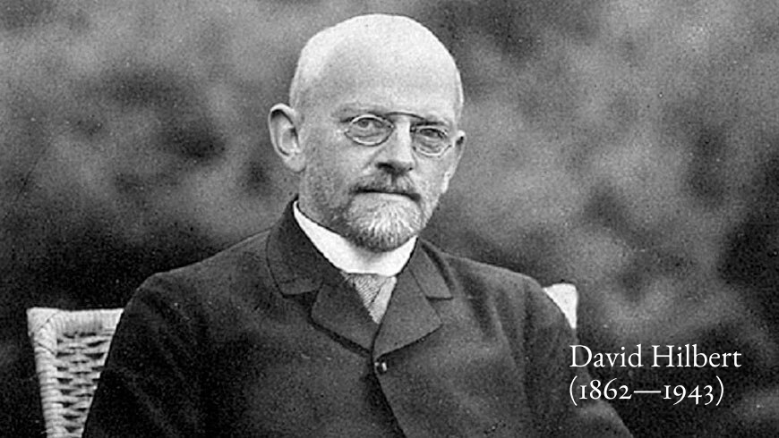

# Understanding Lambda Calculus

**This is a placeholder repo for my Lambda Calculus page. Please go here for the original website which will be published shortly: https://prabros.com/lambda-calculus/**

Lambda Calculus is a term usually tossed around in the programming circles supposedly providing the undergirding for functional programming, but I find very rarely understood for what it is in it's original flavour. I undertook this quest to find out what it finally is about and here are my findings. This tutorial will give the necessary theory grounding to build up your own Lambda Calculus language you can play with.

## Motivation
While it was comforting to remain in the shadows of the giants and take the computer stack for granted, half a decade hacking on the system and constantly consuming articles from people active in the community, you develop this notion that most of the technology that we take for granted has reached this point of iteration after going through considerable amounts of constraints, not all of which are immutable or geared for the welfare of a daily programmer. Some are well thought out, many are historical accidents, and a great many micro-decisions that manifests at the day to day level are just utter chaos resulting from decisions with rationale as weak as "if its not broken, dont fix it, and ramp up the complexity to 11". After realizing that I was in the breads and circuses business of pop culture computing, I thought of looking elsewhere and thats when I figured the answer could lie beneath the historical layers. A lot of great many works in the past inspired me and I continued to look further where in I found out that one needs to have a good understanding of an entire system inorder to figure out why/how/what is happening at any one particular level. So in that sense, this document is a thorough look at the language level of a functional programming language that is commonly used as the lingua franca to translate the electrical  communicate with the computer system.

# A little history

Church's formalization of Lambda Calculus came in direct response to Entscheidungsproblem which was formulated by Hilbert. Hilbert's original problem required an algorithm a statement of first-order logic and checking if it is valid in every structure satisfying the axioms. This condition means that the axioms of the first order logic will logically entail (that is can be used to produce) any statement which is held in a structure built up of the axioms. Inorder to begin answering this question, Church came up with the conceptual structure of Lambda Calculus in which computation of a function can be thought of as its logical entailment achieving a definite answer. Once this conceptual structure was obtained, Church answered this question in negative, that is, not every statement existing in an axiomatic structure can be "effectively calculated".

As a byproduct of this enquiry, they also had to formalize the definition of an algorithm and "effectively calculable".

In my current research, the question was first touched upon by Leibniz, then Boole, then Frege in Begriffsschrift, on and on until it became a well researched strand of theoretical research. The structure of addressing this problem as that of computability emerged in history after its emergence from the famous [Hilbert Problems](https://en.wikipedia.org/wiki/Hilbert%27s_problems).

<!-- Talk about how decidable/undeciddable problems factors in here -->

# Elements of Lambda Calculus
The essential primitives of Lambda Calculus are three things:

## Variables
Variables store an abstraction built up of functions. These can be thought of as names and these names carry meaning as it is assigned in the interpretational framework. Only a tower of interpretational layers, some of which lives inside the head of a user who is interpreting these signs is what gives them a meaning. The objective results that one gains through these so called "calculations" are only made meaningful when we know what the results signify in the larger framework of Mathematics. In this sense, Lambda Calculus can be thought of as an upward accumulation and downward travel and the intermediate states which signify things meaningful to us humans. It is a simple mechanism by which exploration through mathematical signs in a rigorous, automatic, and rule driven manner.

## Abstraction
Abstraction can be thought of as lifting up, or an upward creation of an equivalent structure which can be parametrized. These parameters can be other values similarly abstracted. Abstractions commonly lead to a higher level representation/structure. A function formed in this function can be thought of as an expression that can be applied.

## Application
Application can be thought of as projecting, or a downward traversal.

# Identifying parts of an expression
In an expression like: `λval.val + 3` `λval.` is the head and `val + 3` is the body.

Head is for pattern matching the bound variables. The ones that appear in the body are free variables. The head directly identifies which values in the body is to be replaced.

# Using the primitives
The primitives can be put together to compose expressions which can be evaluated to produce a result. The evaluation proceeds by continuously applying the functions until a resultant value is produced.

# A network traversal metaphor of computation
The trinity of variables acting as names, functions, and application can be thought of as a memory network (DAG) which is continuously traversed to obtain a sequence of values in the end. So evaluation is a continuous graph traversal built up of values which can be stored as variables. These values form a network by composing functions together. These functions act are a mapping between values which can be realized by passing the appropriate argument. The process by which it is realized is called an application. Thus variables when passed to functions on application is how Lambda Calculus performs computation.

# Essential Operations

## Alpha Conversion
Alpha conversion creates a non-conflicting namespace for proper application to follow. Another way to perform this is using DeBrujjn's index that makes use of an ordinal system to create non-conflicting namespaces.

## Beta Reduction
`⋀fun.⋀arg.(fun arg) add 3 |- (add 3)`

## Eta Reduction
` ⋀name.(func name) |-  `

# Variables

# Bound Variables
# Application

<!-- Insert an abstraction -> concretization/specialization diagram -->

# Bound/Free Variables : Open/Closed Expressions

# Redex

## Parameter Expression vs. Argument Expression

# Applicative Order / Normal Order

# Normal Form
Something is in normal form when it can't be reduced further.

# Church Numerals
<!-- Give a brief history of Church Encoding and its uses. -->

# Trivia
While the untyped variant of Lambda Calculus is thought of as a canonical model that can carry out any conceivable computation, not all variants of Lambda Calculus is so. This property of being able to complete any computation is termed as **Turing Completeness** and the typed variant of Lambda Calculus is not Turing Complete.

# Models of computation

Recursive function theory by Gödel and Kleene.
Turing Machine by Alan Turing.

# Nuances and tacit knowledge

Very small changes in the way you create a language on top of Lambda Calculus could yield very different results.
And there are tacit ideas like evaluation and combination undergirding the calculus, which if made explicit would give you a very different way of making programs tractable. One such example is the Kernel language, that uses an abstraction called vau instead of lambda to get evaluations and combinations done: https://web.cs.wpi.edu/~jshutt/kernel.html

TODO: Catalogue other such spin-offs of Lambda Calculus and document the different lines of inquiry it has spun-off.
